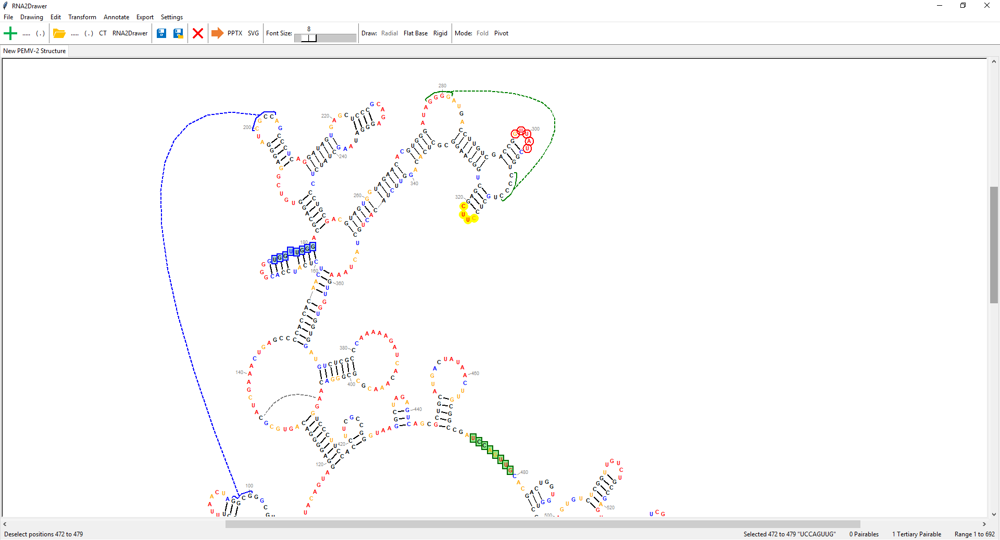
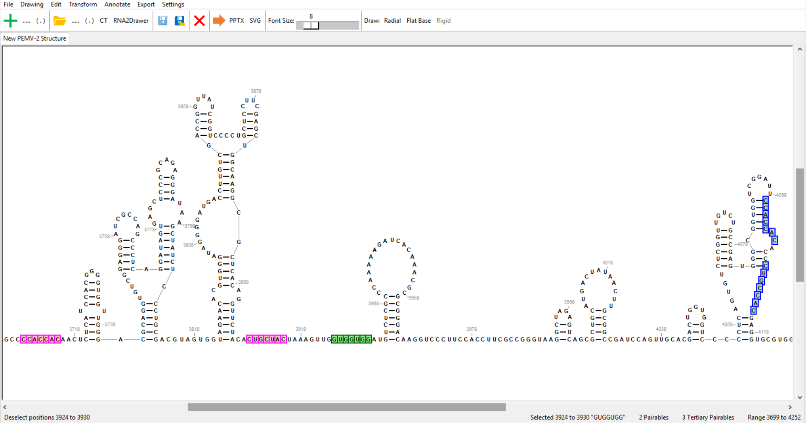
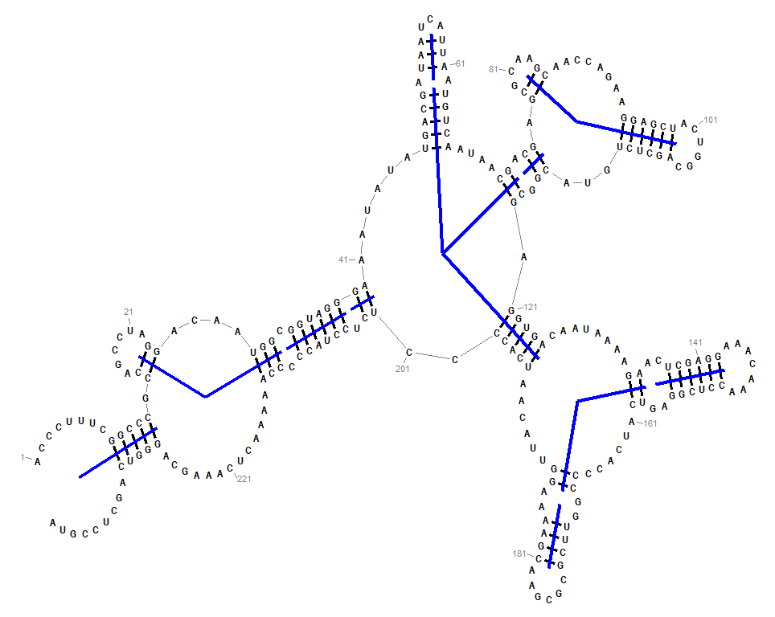
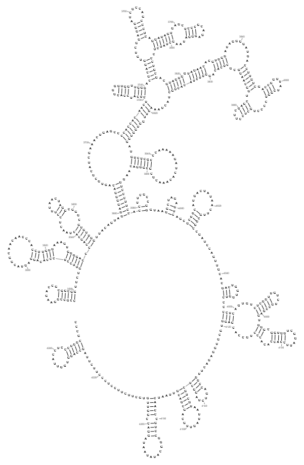
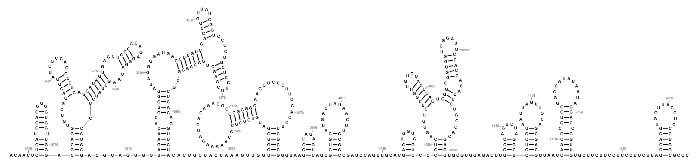
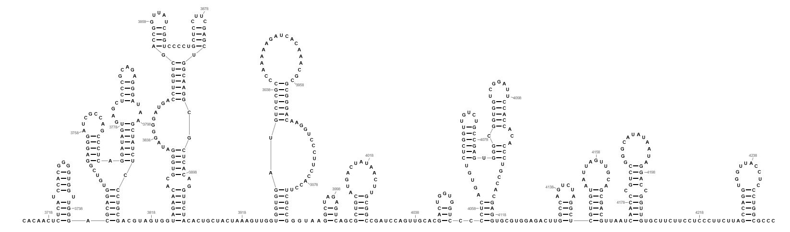
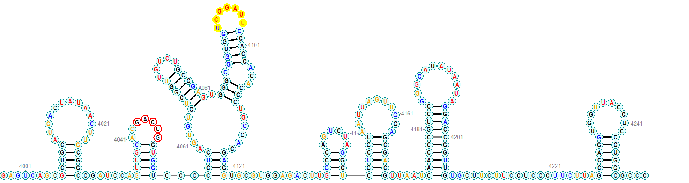
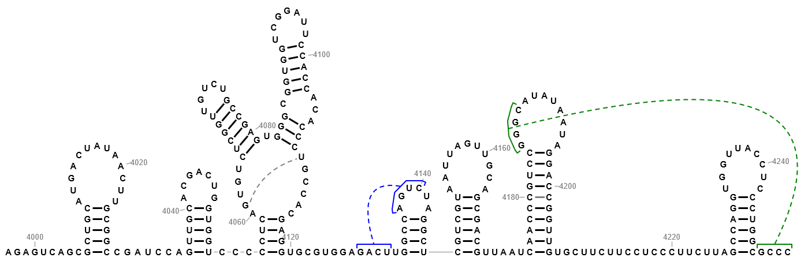
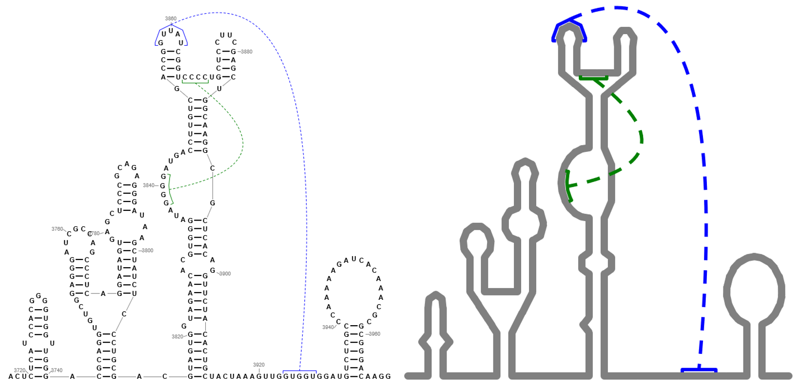

# RNA2Drawer

Easily edit 2-D nucleic acid structure drawings and export them as PowerPoint or SVG files. All elements of the drawings (e.g. bases, bonds) are exported as PowerPoint or SVG objects, allowing for further manipulation in PowerPoint or a vector graphics editor such as Adobe Illustrator.

&nbsp;&nbsp;&nbsp;&nbsp;<b>Publication:</b> [https://www.ncbi.nlm.nih.gov/pubmed/?term=RNA2Drawer](https://www.ncbi.nlm.nih.gov/pubmed/?term=RNA2Drawer)

&nbsp;&nbsp;&nbsp;&nbsp;<b><em>If you use RNA2Drawer to draw structures in a publication, please cite the above article.</em></b> 
&nbsp;&nbsp;&nbsp;&nbsp;

  

Questions? See [Frequently Asked Questions](#frequently-asked-questions) and the [Discussion Forum](https://sourceforge.net/p/rna2drawer/discussion/general/) or email rna2drawerqa@gmail.com.

&nbsp;&nbsp;&nbsp;&nbsp;&nbsp;&nbsp;[Installation](#installation) 
&nbsp;&nbsp;&nbsp;&nbsp;&nbsp;&nbsp;[Creating a New Structure](#creating-a-new-structure) 
&nbsp;&nbsp;&nbsp;&nbsp;&nbsp;&nbsp;[The Structure Editing Canvas](#the-structure-editing-canvas) 
&nbsp;&nbsp;&nbsp;&nbsp;&nbsp;&nbsp;&nbsp;&nbsp;&nbsp;&nbsp;[Folding Mode](#folding-mode) 
&nbsp;&nbsp;&nbsp;&nbsp;&nbsp;&nbsp;&nbsp;&nbsp;&nbsp;&nbsp;[Pivoting Mode](#pivoting-mode) 
&nbsp;&nbsp;&nbsp;&nbsp;&nbsp;&nbsp;[Drawing Styles](#drawing-styles) 
&nbsp;&nbsp;&nbsp;&nbsp;&nbsp;&nbsp;&nbsp;&nbsp;&nbsp;&nbsp;[The Radial Drawing Style](#the-radial-drawing-style) 
&nbsp;&nbsp;&nbsp;&nbsp;&nbsp;&nbsp;&nbsp;&nbsp;&nbsp;&nbsp;[The Flat Base Drawing Style](#the-flat-base-drawing-style) 
&nbsp;&nbsp;&nbsp;&nbsp;&nbsp;&nbsp;&nbsp;&nbsp;&nbsp;&nbsp;[The Rigid Drawing Style](#the-rigid-drawing-style) 
&nbsp;&nbsp;&nbsp;&nbsp;&nbsp;&nbsp;&nbsp;&nbsp;&nbsp;&nbsp;[General Styles](#general-styles) 
&nbsp;&nbsp;&nbsp;&nbsp;&nbsp;&nbsp;[Other Customizations](#other-customizations) 
&nbsp;&nbsp;&nbsp;&nbsp;&nbsp;&nbsp;[Rotation](#rotation) 
&nbsp;&nbsp;&nbsp;&nbsp;&nbsp;&nbsp;[Base Colors and Outlines/Fills](#base-colors-and-outlinesfills) 
&nbsp;&nbsp;&nbsp;&nbsp;&nbsp;&nbsp;[Noncanonical Base Pairs](#noncanonical-base-pairs) 
&nbsp;&nbsp;&nbsp;&nbsp;&nbsp;&nbsp;[Tertiary Interactions](#tertiary-interactions) 
&nbsp;&nbsp;&nbsp;&nbsp;&nbsp;&nbsp;[Saving Your Work](#saving-your-work) 
&nbsp;&nbsp;&nbsp;&nbsp;&nbsp;&nbsp;[Exporting Your Drawing](#exporting-your-drawing) 
&nbsp;&nbsp;&nbsp;&nbsp;&nbsp;&nbsp;[Drawing Structures as Lines](#drawing-structures-as-lines) 
&nbsp;&nbsp;&nbsp;&nbsp;&nbsp;&nbsp;[Drawing with Fixed Coordinates](#drawing-with-fixed-coordinates) 
&nbsp;&nbsp;&nbsp;&nbsp;&nbsp;&nbsp;[Frequently Asked Questions](#frequently-asked-questions) 

## Installation

### Windows

Download the ZIP file<b>*</b> of the Windows executable for RNA2Drawer [here](https://sourceforge.net/projects/rna2drawer/). Inside the ZIP file will be just a folder named `RNA2Drawer`. You can extract this folder to anywhere on your computer. (A convenient place might be your Desktop.) After you've extracted the folder, enter it. Inside you'll find an Application file named `RNA2Drawer`. Right-click it, highlight `Send to`, and click `Desktop (create shortcut)`. Now you can open RNA2Drawer by double-clicking the shortcut on your Desktop.

There might be a delay the first time you open RNA2Drawer as Windows performs a security scan. Windows might also ask you to give permission for the application to run.

<b>*A ZIP file is a compressed file format. Its contents must be extracted (decompressed) before they can be used.</b>

### Mac

First, download and run the installer for [XQuartz](https://www.xquartz.org/). Then, download and run the installer for "[Wine Stable](https://dl.winehq.org/wine-builds/macosx/download.html)".

Download the ZIP file<b>*</b> of RNA2Drawer [here](https://sourceforge.net/projects/rna2drawer/). Find the ZIP file in your Downloads folder and unzip it (if Safari has not already done so automatically). This will place a folder named `RNA2Drawer` in your Downloads folder. Enter the `RNA2Drawer` folder and find the file `RNA2Drawer.exe`. Control-click it, select `Make Alias`, and drag the newly created alias to your Desktop. Now you can open RNA2Drawer by double-clicking the alias on your Desktop.

Wine may have to install some additional packages the first time you open RNA2Drawer. You can also move the `RNA2Drawer` folder to anywhere on your computer.

<b>*A ZIP file is a compressed file format. Its contents must be unzipped (decompressed) before they can be used.</b>

### Linux

The [Windows executable](https://sourceforge.net/projects/rna2drawer/) for RNA2Drawer can be run via [Wine](https://www.winehq.org/). RNA2Drawer can also be run from source code as described below.

### Running from Source

A ZIP file of the source and test code and documentation for manual tests can be downloaded [here](https://sourceforge.net/projects/rna2drawer-source/).

To run from source, you will need to have installed a Python 3 interpreter and the Tcl/Tk GUI toolkit, which is typically bundled with Python. RNA2Drawer is also dependent on the following libraries (all installable with `pip`): `Pmw`, `python-pptx`, and `webcolors`.

To run RNA2Drawer, enter the `rna2drawer` directory on a command terminal and feed the source file `RNA2Drawer.py` to the Python 3 interpreter with the command `python RNA2Drawer.py`. This should open the application.

If you happen to have Python 2 installed alongside Python 3, note that the Python 3 interpreter can be specifically accessed by the name `python3` on Mac and Linux systems. Similarly, `pip` for Python 3 can be specifically accessed by the name `pip3`.

### Uninstalling

Just delete the RNA2Drawer shortcut on your Desktop and delete the RNA2Drawer folder.

## Creating a New Structure

In `File` -> `New`, you can enter a plain sequence that will be drawn single-stranded, or enter the dot-bracket notation of a structure.

In `File` -> `Open`, you can open: <em>i</em>) a plain sequence, <em>ii</em>) a FASTA file, <em>iii</em>) the dot-bracket notation of a structure, <em>iv</em>) a CT file generated by Mfold, or <em>v</em>) the RNA2Drawer file of a saved tab.

Make sure that whatever you input complies with the parsing steps detailed in the popup windows.

## The Structure Editing Canvas

Each structure is drawn in a separate tab of the structure editing canvas. The structure editing canvas has two editing modes: folding and pivoting. Switch between them using the `Mode` buttons on the toolbar.

### Folding Mode

This editing mode allows you to pair and unpair bases.

Clicking a base selects it, and pressing the left and right arrow keys adds/removes neighboring bases from the selection. (Holding `Shift` while pressing the left and right arrow keys adds/removes neighboring bases from the other side of the selection.) The currently selected subsequence is highlighted in green.

The structure editing canvas automatically highlights all subsequences complementary to the currently selected subsequence. Complementary subsequences whose pairing would not invalidate the secondary structure are highlighted in pink, and clicking on them will form the pairing in the secondary structure. All other complementary subsequences are highlighted in blue, and clicking on them will open a popup to form a tertiary interaction (see [Tertiary Interactions](#tertiary-interactions)).

Alternatively, selecting and clicking a set of bases that are already paired will break all base pairs involving those bases. The currently selected subsequence will be highlighted in red when clicking on it would break base pairs and it is hovered.

From the `Settings` dropdown menu, GU (and GT) pairs can be excluded from highlighted complementary subsequences, and the percentage of matching pairs required for a complementary subsequence to be highlighted can be relaxed.

The bottom bar of the structure editing canvas also contains some helpful information: (from left to right) what clicking the mouse will do, the currently selected subsequence, the number of pairable subsequences, and the sequence range.

  

<dl><dd>The currently selected subsequence (positions 3,924 to 3,930) is highlighted in green. Two subsequences complementary to the currently selected subsequence whose pairings can be incorporated into the secondary structure are highlighted in pink. Two complementary subsequences whose pairings would be tertiary are highlighted in blue.</dd></dl>

### Pivoting Mode

In this editing mode you can pivot stems around their loops, allowing you to control the layout of your drawing and resolve base overlaps.

Every stem will have a pivoter (a blue line) running down its center. Left-clicking a pivoter and moving the mouse will pivot the stem in the direction of the mouse, first compressing the single strand that the stem pivots towards and then expanding the single strand on the other side of the stem. Right-clicking a pivoter will only expand the single strand away from the mouse movement.

  

<dl><dd>A structure in the radial drawing style with pivoters shown.</dd></dl>

## Drawing Styles

RNA2Drawer has three drawing styles: radial, flat base, and rigid. Structures are drawn in the radial style by default. Switch between them using the `Draw` buttons on the toolbar.

### The Radial Drawing Style

  

You can edit the following parameters in `Drawing` -> `Radial Styles`.

&nbsp;&nbsp;&nbsp;&nbsp;`Rotation`: The rotation of the drawing. 
&nbsp;&nbsp;&nbsp;&nbsp;`Base Pair Bond Length`: How long base pair bonds are. 
&nbsp;&nbsp;&nbsp;&nbsp;`Termini Gap Size`: The distance between the 5' and 3' ends of the sequence. 

### The Flat Base Drawing Style

  

You can edit the following parameters in `Drawing` -> `Flat Base Styles`.

&nbsp;&nbsp;&nbsp;&nbsp;`Rotation`: The rotation of the drawing. 
&nbsp;&nbsp;&nbsp;&nbsp;`Base Pair Bond Length`: How long base pair bonds are. 

### The Rigid Drawing Style

  

You can edit the following parameters in `Drawing` -> `Rigid Styles`.

&nbsp;&nbsp;&nbsp;&nbsp;`Rotation`: The rotation of the drawing. 
&nbsp;&nbsp;&nbsp;&nbsp;`Include Base Pair Bonds`: Toggle to draw base pair bonds. 
&nbsp;&nbsp;&nbsp;&nbsp;`Base Pair Bond Length`: How long base pair bonds are. 
&nbsp;&nbsp;&nbsp;&nbsp;`Minimum Branch Angle`: How squat multibranch loops can be.

You cannot pivot stems with the rigid drawing style.

### General Styles

The following parameters are common to all drawing styles. You can edit them in `Drawing` -> `General Styles`.

Colors used are the CSS web standards.

&nbsp;&nbsp;&nbsp;&nbsp;`Base` -> 
&nbsp;&nbsp;&nbsp;&nbsp;&nbsp;&nbsp;`Base Font`: The font of bases (e.g. Arial Narrow, Times New Roman). 
&nbsp;&nbsp;&nbsp;&nbsp;&nbsp;&nbsp;`Base Font Size`: The font size of bases. 
&nbsp;&nbsp;&nbsp;&nbsp;&nbsp;&nbsp;`Bold Bases`: Toggle to draw bases in bold. 
&nbsp;&nbsp;&nbsp;&nbsp;&nbsp;&nbsp;`Base Width`: The width of the area given to a base. 
&nbsp;&nbsp;&nbsp;&nbsp;&nbsp;&nbsp;`Base Height`: The height of the area given to a base. 

Letters in different fonts take up different amounts of space. When changing the font of bases, consider adjusting `Base Width` and `Base Height` to give bases their needed space.

&nbsp;&nbsp;&nbsp;&nbsp;`Base Pair Bond` -> 
&nbsp;&nbsp;&nbsp;&nbsp;&nbsp;&nbsp;`Base Pair Bond Thickness`: The thickness of base pair bonds. 
&nbsp;&nbsp;&nbsp;&nbsp;&nbsp;&nbsp;`Base Pair Padding`: The gap between a base pair bond and the bases it connects. 
&nbsp;&nbsp;&nbsp;&nbsp;&nbsp;&nbsp;`AU (and AT) Bond Color`: The color of AU and AT bonds. 
&nbsp;&nbsp;&nbsp;&nbsp;&nbsp;&nbsp;`GC Bond Color`: The color of GC bonds. 
&nbsp;&nbsp;&nbsp;&nbsp;&nbsp;&nbsp;`GU (and GT) Bond Color`: The color of GU and GT bonds. 
&nbsp;&nbsp;&nbsp;&nbsp;&nbsp;&nbsp;`Noncanonical Bond Color`: The color of noncanonical base pair bonds.

&nbsp;&nbsp;&nbsp;&nbsp;`Strand Line` -> 
&nbsp;&nbsp;&nbsp;&nbsp;&nbsp;&nbsp;`Strand Line Thickness`: The thickness of strand lines. 
&nbsp;&nbsp;&nbsp;&nbsp;&nbsp;&nbsp;`Strand Line Color`: The color of strand lines. 
&nbsp;&nbsp;&nbsp;&nbsp;&nbsp;&nbsp;`Strand Line Padding`: The gap between a strand line and the bases it connects. 
&nbsp;&nbsp;&nbsp;&nbsp;&nbsp;&nbsp;`Strand Line Threshold`: The minimum distance between two consecutive bases for a strand line to be drawn.

&nbsp;&nbsp;&nbsp;&nbsp;`Numbering` -> 
&nbsp;&nbsp;&nbsp;&nbsp;&nbsp;&nbsp;`Numbering Font`: The font of numbering (e.g. Arial, Times New Roman). 
&nbsp;&nbsp;&nbsp;&nbsp;&nbsp;&nbsp;`Numbering Font Size`: The font size of numbering. 
&nbsp;&nbsp;&nbsp;&nbsp;&nbsp;&nbsp;`Bold Numbering`: Toggle to draw numbering in bold. 
&nbsp;&nbsp;&nbsp;&nbsp;&nbsp;&nbsp;`Numbering Color`: The color of numbering. 
&nbsp;&nbsp;&nbsp;&nbsp;&nbsp;&nbsp;`Numbering Line Length`: The length of numbering lines. 
&nbsp;&nbsp;&nbsp;&nbsp;&nbsp;&nbsp;`Numbering Line Thickness`: The thickness of numbering lines. 
&nbsp;&nbsp;&nbsp;&nbsp;&nbsp;&nbsp;`Numbering Line Color`: The color of numbering lines. 
&nbsp;&nbsp;&nbsp;&nbsp;&nbsp;&nbsp;`Numbering Line Padding`: The gap between a numbering line and the base it is attached to.

&nbsp;&nbsp;&nbsp;&nbsp;`Background` -> 
&nbsp;&nbsp;&nbsp;&nbsp;&nbsp;&nbsp;`Background Color`: The color of the background. 

## Other Customizations

In the `Edit` dropdown menu, you can change:

&nbsp;&nbsp;&nbsp;&nbsp;`Name`: The name of the current tab.

&nbsp;&nbsp;&nbsp;&nbsp;`Sequence Numbering Offset`: The shift in numbering. (Same as in Mfold.) 
&nbsp;&nbsp;&nbsp;&nbsp;`Numbering Start`: Determines what position numberings start at. 
&nbsp;&nbsp;&nbsp;&nbsp;`Numbering Interval`: The spacing between numberings.

&nbsp;&nbsp;&nbsp;&nbsp;`Convert to DNA (Us to Ts)`: Converts all Us to Ts while maintaining all base pairs. 
&nbsp;&nbsp;&nbsp;&nbsp;`Convert to RNA (Ts to Us)`: Converts all Ts to Us while maintaining all base pairs.

## Rotation

You can rotate your drawing using the options in the `Transform` dropdown menu. You can also incrementally rotate your drawing by 1 degree right or left by pressing the `R` and `L` keys, respectively.

## Base Colors and Outlines/Fills

The color of a base refers to the color of its letter. Additionally, a circle can be drawn behind a base, whose outline and fill can be adjusted. Base colors and outlines/fills can be set in the `Annotate` dropdown menu.

The following parameters can be set for base outlines/fills.

&nbsp;&nbsp;&nbsp;&nbsp;`Outline Color`: The color of the outline of the circle. 
&nbsp;&nbsp;&nbsp;&nbsp;`Outline Thickness`: The thickness of the outline of the circle. 
&nbsp;&nbsp;&nbsp;&nbsp;`Fill Color`: The color of the inside of the circle. 
&nbsp;&nbsp;&nbsp;&nbsp;`Radius`: The size of the circle.

Colors used are the CSS web standards.

Base colors and outlines/fills can be set by the following schemes.

&nbsp;&nbsp;&nbsp;&nbsp;`By Position`: A set of positions. 
&nbsp;&nbsp;&nbsp;&nbsp;`By Subsequence`: e.g. all Us in a structure, all instances of AUGC. 
&nbsp;&nbsp;&nbsp;&nbsp;`By Structure`: Whether a base is paired or unpaired. 
&nbsp;&nbsp;&nbsp;&nbsp;`By Structure Probing Data (e.g. SHAPE)`: A set of reactivity values (or any set of values) read from a file. 
&nbsp;&nbsp;&nbsp;&nbsp;`By Selection`: The currently selected subsequence.

The popups for setting base colors and outlines/fills contain more detailed instructions on setting base colors and outlines/fills by these schemes.

  

<dl><dd>The letters of bases are colored according to structure probing reactivity data. Positions 4,043 to 4,047 have red outlines with transparent fills. Positions 4,092 to 4,098 have yellow fills with transparent outlines. All other positions have dark cyan outlines with light cyan fills. The width and height of the area given to bases are increased to accommodate the base outlines/fills (see <a href="https://github.com/pzhaojohnson/RNA2Drawer/blob/master/README.md#general-styles">General Styles</a>).</dd></dl>

## Noncanonical Base Pairs

In `Annotate` -> `Add a Noncanonical Base Pair`, you can specify two positions to pair, regardless of canonical base pairing rules. This will form the base pair as long as it does not invalidate the secondary structure. The noncanonical base pair is treated like any other base pair in the secondary structure. The color of noncanonical base pair bonds is determined by the `Noncanonical Bond Color` drawing parameter in [General Styles](#general-styles).

RNA2Drawer does not decorate noncanonical base pair bonds (e.g. with squares, triangles) to indicate specific types of noncanonical base pairs. Users are left to decorate noncanonical base pair bonds in exported PowerPoint and SVG files.

If you do not want a noncanonical base pair to be incorporated into the secondary structure, it can be represented as a tertiary interaction (see [Tertiary Interactions](#tertiary-interactions)).

## Tertiary Interactions

Tertiary interactions (e.g. pseudoknots, kissing loop interactions) are represented by a curved line connecting two subsequences, with a line drawn over each of the two subsequences capping them. Tertiary interactions can be added in `Annotate` -> `Add a Tertiary Interaction`.

The curve of a tertiary interaction can be adjusted by left-clicking it and moving the mouse. Right-clicking the curve of a tertiary interaction opens a popup that allows you to edit its parameters (as well as delete it). You can set the following parameters for a tertiary interaction.

&nbsp;&nbsp;&nbsp;&nbsp;`Line Color`: The color of the lines of a tertiary interaction. 
&nbsp;&nbsp;&nbsp;&nbsp;`Line Thickness`: The thickness of the lines of a tertiary interaction. 
&nbsp;&nbsp;&nbsp;&nbsp;`Top Padding`: The distance between bases and the tops of the caps. 
&nbsp;&nbsp;&nbsp;&nbsp;`Side Padding`: The distance between bases and the sides of the caps. 
&nbsp;&nbsp;&nbsp;&nbsp;`Side Length`: The length of the sides of the caps.

Colors used are the CSS web standards.

Setting `Top Padding` and `Side Length` to negative values will draw the caps over the inner sides of the two subsequences of a tertiary interaction.

To represent a noncanonical base pair as a tertiary interaction, set the two subsequences of the tertiary interaction to the two positions of the noncanonical base pair. You may also uncheck the options to draw caps over the two positions.

  

<dl><dd>Two tertiary interactions (colored green and blue) are drawn with caps over the subsequences they connect. A noncanonical base pair between positions 4,180 and 4,201 (colored gray) is incorporated into the secondary structure. A noncanonical base pair between positions 4,061 and 4,110 (also colored gray) is represented by a tertiary interaction without caps. To draw it over the inner side of the loop, its top padding was made negative.</dd></dl>

## Saving Your Work

You can save a tab and all of its contents in an RNA2Drawer file (with the extension `.rna2drawer`). This is a text file containing all the details of a tab's structure drawing (e.g. fonts, colors, base pairs). Opening an RNA2Drawer file in RNA2Drawer will open the tab exactly as it was when it was saved.

## Exporting Your Drawing

Your drawing can be exported in the following ways via the options in the `Export` dropdown menu.

### PowerPoint (PPTX) and SVG

All aspects of your drawing (e.g. bases, bonds) are exported as PowerPoint or SVG objects, allowing for further manipulation in PowerPoint or a vector graphics editor such as Adobe Illustrator. Scale your exported drawing by specifying the font size of bases in the popup window. All other aspects of the drawing (e.g. line thicknesses) will be scaled along with the font size of bases.

### Screenshot

A screenshot of the current view of the structure editing canvas can be saved as a PNG file.

<b><em>This feature is not able to properly handle display scaling on Windows.</em></b> Right now taking a screenshot on Windows requires that display scaling be set to 100%. Otherwise, the boundaries of the screenshot will be incorrect.

### Secondary Structure

The secondary structure of your drawing can be saved in a text file as dot-bracket notation or Mfold forcings. Tertiary interactions (e.g. pseudoknots) will not be included in the exported secondary structure notation.

### VARNA

A VARNA file (with extension `.VARNA`) of your drawing can be created, which can be opened in VARNA itself. As many aspects of your drawing as possible will be preserved in the exported VARNA file.

## Drawing Structures as Lines

Structures can be drawn as lines with some creative styling.

  

&nbsp;&nbsp;&nbsp;&nbsp;`General Styles` -> 
&nbsp;&nbsp;&nbsp;&nbsp;&nbsp;&nbsp;&nbsp;&nbsp;`Base` -> 
&nbsp;&nbsp;&nbsp;&nbsp;&nbsp;&nbsp;&nbsp;&nbsp;&nbsp;&nbsp;`Base Font Size`: 9.0 
&nbsp;&nbsp;&nbsp;&nbsp;&nbsp;&nbsp;&nbsp;&nbsp;`Strand Line` -> 
&nbsp;&nbsp;&nbsp;&nbsp;&nbsp;&nbsp;&nbsp;&nbsp;&nbsp;&nbsp;`Strand Line Thickness`: 13.5 
&nbsp;&nbsp;&nbsp;&nbsp;&nbsp;&nbsp;&nbsp;&nbsp;&nbsp;&nbsp;`Strand Line Color`: grey 
&nbsp;&nbsp;&nbsp;&nbsp;&nbsp;&nbsp;&nbsp;&nbsp;&nbsp;&nbsp;`Strand Line Padding`: 0.001 
&nbsp;&nbsp;&nbsp;&nbsp;&nbsp;&nbsp;&nbsp;&nbsp;&nbsp;&nbsp;`Strand Line Threshold`: 0.001

To fill the gaps between strand lines, outlines/fills were given to each base with parameters (`Outline Color`: grey, `Outline Thickness`: 1.0, `Fill Color`: grey, `Radius`: 0.666).

To hide the letters of bases, the color of each base was made grey.

Adjust the ratios and colors of these parameters as desired.

The `Line Thickness` of tertiary interactions was also made 6.0, and base pair lines and numbering were excluded from the exported drawing.

## Drawing with Fixed Coordinates

In `File` -> `Open` -> `Fixed Coordinates`, you can draw single-stranded structures in fixed layouts produced by other drawing programs.

Notably, RNA2Drawer can draw structures from the X and Y coordinates of bases in a [RiboSketch](https://rnastructure.cancer.gov/ribosketch/) (RS) file.

Alternatively, RNA2Drawer can draw structures from a file containing the coordinates of bases formatted in the following way. For example, the following would draw a small hairpin named `small_hairpin`.

`>small_hairpin` 
`ACCCUUUUGGGA` 
`.(((....))).` 
`0.0,1.0,1.0,1.0,0.5,1.5,2.5,3.5,3.0,3.0,3.0,4.0` 
`0.0,0.0,1.0,2.0,3.0,4.0,4.0,3.0,2.0,1.0,0.0,0.0`

The first line is the name of the sequence, the second line is the sequence, the third line is the dot-bracket notation of the secondary structre, the fourth line contains the X coordinates of bases, and the fifth line contains the Y coordinates of bases (where coordinates are separated by commas).

This feature allows other drawing programs to use RNA2Drawer's faculties for customizing a drawing and exporting drawings as PPTX and SVG files.

## Frequently Asked Questions

If you have additional questions not answered here, see the [Discussion Forum](https://sourceforge.net/p/rna2drawer/discussion/general/) or email rna2drawerqa@gmail.com.

<em>How do I zoom in and out?</em> Changing the font size of bases using the `Font Size` scale on the toolbar mimics zooming in and out, though this does not change the sizes of the other elements of the drawing.

<em>What colors are available?</em> RNA2Drawer converts names of colors to RGB values according to the CSS web standards, so a complete list of available colors can be found online (like [here](https://www.w3schools.com/cssref/css_colors.asp)).

<em>What base annotations are available?</em> In the `Annotate` dropdown menu, the colors of bases can be set, and circles can be drawn behind bases with customizable outlines and fills.

<em>Can bases be colored according to chemical structure probing data?</em> Yes, via the option in the `Annotate` dropdown menu. This feature allows bases to be sequentially colored according to any list of data as well.

<em>Can I draw DNA instead of RNA?</em> Yes, when entering a new structure or opening one from a file, you can parse the sequence as DNA. You can also convert an existing RNA structure to DNA (see [Other Customizations](#other-customizations)).

<em>How do I delete a tertiary interaction?</em> Right-clicking the tertiary interaction will open a popup for modifying the tertiary interaction, as well as deleting it.

<em>Can the drawing be globally rotated (while keeping base letters upright)?</em> Yes, see [Rotation](#rotation).

<em>Can I draw structures as lines?</em> With some creative styling. See [Drawing Structures as Lines](#drawing-structures-as-lines).

<em>I cannot pivot the stem closest to the 5' terminus.</em> The stem closest to the 5' terminus serves as an anchor for the entire drawing. The angle of the stem closest to the 5' terminus can only be changed by rotating the entire drawing (see [Rotation](#rotation)).

<em>What is the maximum sequence size?</em> Currently, a maximum sequence size of 5,000 nucleotides has been arbitrarily set, as the application tends to run slowly for larger sequences. Note that drawings of subsequences from a larger sequence can still be given large numberings via the `Sequence Numbering Offset` parameter (see [Other Customizations](#other-customizations)).

<em>Must one end of the currently selected subsequence always be fixed when adjusting its range with the arrow keys?</em> Toggling the `Shift` key on and off allows you to adjust both ends of the currently selected subsequence using the arrow keys.
