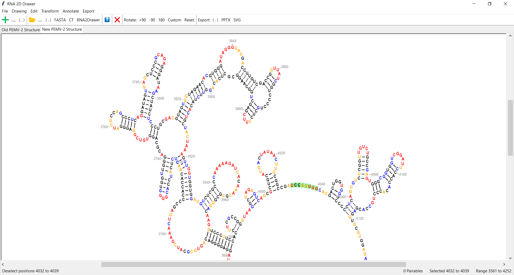
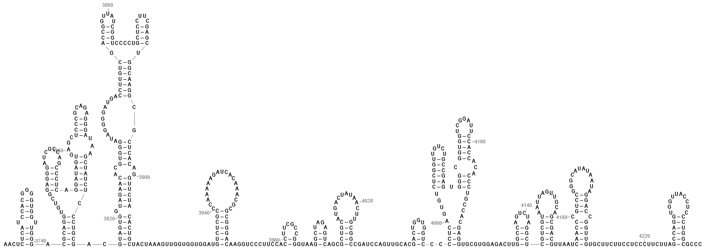
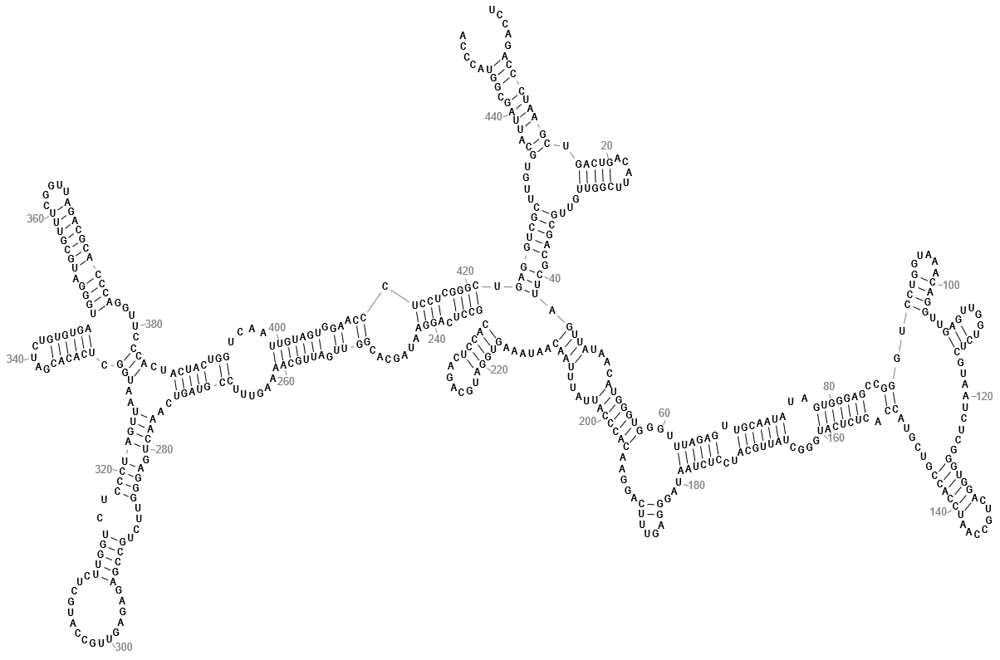

# RNA2Drawer

Easily edit nucleic acid secondary structure drawings and export them as PowerPoint or SVG files. All elements of the drawings (e.g. bases, bonds) are exported as PowerPoint or SVG objects, allowing for further manipulation in PowerPoint or a vector graphics editor such as Adobe Illustrator.

Questions? See [Frequently Asked Questions](#frequently-asked-questions).

&nbsp;&nbsp;&nbsp;&nbsp;&nbsp;&nbsp;[Installation](#installation) 
&nbsp;&nbsp;&nbsp;&nbsp;&nbsp;&nbsp;[Creating a New Structure](#creating-a-new-structure) 
&nbsp;&nbsp;&nbsp;&nbsp;&nbsp;&nbsp;[The Structure Editing Canvas](#the-structure-editing-canvas) 
&nbsp;&nbsp;&nbsp;&nbsp;&nbsp;&nbsp;[Drawing Styles](#drawing-styles) 
&nbsp;&nbsp;&nbsp;&nbsp;&nbsp;&nbsp;&nbsp;&nbsp;&nbsp;&nbsp;[General Styles](#general-styles) 
&nbsp;&nbsp;&nbsp;&nbsp;&nbsp;&nbsp;&nbsp;&nbsp;&nbsp;&nbsp;[The Rigid Drawing Style](#the-rigid-drawing-style) 
&nbsp;&nbsp;&nbsp;&nbsp;&nbsp;&nbsp;&nbsp;&nbsp;&nbsp;&nbsp;[The Radial Drawing Style](#the-radial-drawing-style) 
&nbsp;&nbsp;&nbsp;&nbsp;&nbsp;&nbsp;[Other Customizations](#other-customizations) 
&nbsp;&nbsp;&nbsp;&nbsp;&nbsp;&nbsp;[Annotations](#annotations) 
&nbsp;&nbsp;&nbsp;&nbsp;&nbsp;&nbsp;[Saving Your Work](#saving-your-work) 
&nbsp;&nbsp;&nbsp;&nbsp;&nbsp;&nbsp;[Exporting Your Drawing](#exporting-your-drawing) 
&nbsp;&nbsp;&nbsp;&nbsp;&nbsp;&nbsp;[Frequently Asked Questions](#frequently-asked-questions)

## Installation

### Windows 10

Download the ZIP file<b>*</b> of the Windows executable for RNA2Drawer [here](https://sourceforge.net/projects/rna2drawer/). Inside the ZIP file will be just a folder named `RNA2Drawer`. You can extract this folder to anywhere on your computer. (A convenient place might be your Desktop.) After you've extracted the folder, enter it. Inside you'll find an Application file named `RNA2Drawer`. Right-click it, highlight `Send to`, and click `Desktop (create shortcut)`. Now you can open RNA2Drawer by double-clicking the shortcut on your Desktop.

There might be a delay the first time you open RNA2Drawer as Windows performs a security scan. Windows might also ask you to give permission for the application to run.

<b>*A ZIP file is a compressed file format. Its contents must be extracted (decompressed) before they can be used.</b>

### Mac and Linux

Coming soon ...

## Creating a New Structure

In `File` -> `New`, you can enter a plain sequence that will be drawn single-stranded, or enter the dot-bracket notation of a structure.

In `File` -> `Open`, you can open: <em>i</em>) a plain sequence to be drawn single-stranded, <em>ii</em>) a FASTA file, <em>iii</em>) the dot-bracket notation of a structure, <em>iv</em>) a CT file generated by Mfold, or <em>v</em>) the RNA2Drawer file of a saved tab.

Make sure that whatever you enter or the file that you open complies with the parsing steps detailed in the popup windows.

## The Structure Editing Canvas

Each structure is drawn in a separate tab of the structure editing canvas. Clicking a base selects it, and pressing the left and right arrow keys adds/removes neighboring bases from the selection. The structure editing canvas automatically highlights all subsequences that can pair with the currently selected subsequence. Clicking a pairable subsequence forms the pairing. Alternatively, selecting and clicking a set of bases that are already paired will break all base pairs involving those bases.

The bottom bar of the structure editing canvas contains helpful information: (from left to right) what clicking the mouse will do at any given time, the number of pairable subsequences, the currently selected range, and the entire sequence range.

## Drawing Styles

RNA2Drawer has two drawing styles called rigid and radial. By default structures are drawn in the rigid style. Switch between them using the `Draw` buttons on the toolbar.

### General Styles

These parameters common to both the rigid and radial drawing styles. Edit these in `Drawing` -> `General Styles`.

Colors used are the CSS web standards.

&nbsp;&nbsp;&nbsp;&nbsp;`Base` -> 
&nbsp;&nbsp;&nbsp;&nbsp;&nbsp;&nbsp;`Base Font`: The font of bases (e.g. Arial Narrow, Times New Roman). 
&nbsp;&nbsp;&nbsp;&nbsp;&nbsp;&nbsp;`Base Font Size`: The font size of bases. 
&nbsp;&nbsp;&nbsp;&nbsp;&nbsp;&nbsp;`Bold Bases`: Toggle to draw bases in bold. 
&nbsp;&nbsp;&nbsp;&nbsp;&nbsp;&nbsp;`Base Width`: The width of the area allocated to a base. 
&nbsp;&nbsp;&nbsp;&nbsp;&nbsp;&nbsp;`Base Height`: The height of the area allocated to a base. 

Letters in different fonts take up different amounts of space. When changing the font of bases, consider changing `Base Width` and `Base Height` to give bases their needed space.

&nbsp;&nbsp;&nbsp;&nbsp;`Base Pair Bond` -> 
&nbsp;&nbsp;&nbsp;&nbsp;&nbsp;&nbsp;`Base Pair Bond Thickness`: The thickness of base pair bonds. 
&nbsp;&nbsp;&nbsp;&nbsp;&nbsp;&nbsp;`AU (and AT) Bond Color`: The color AU and AT bonds. 
&nbsp;&nbsp;&nbsp;&nbsp;&nbsp;&nbsp;`GC Bond Color`: The color of GC bonds. 
&nbsp;&nbsp;&nbsp;&nbsp;&nbsp;&nbsp;`GU (and GT) Bond Color`: The color of GU and GT bonds. 
&nbsp;&nbsp;&nbsp;&nbsp;&nbsp;&nbsp;`Base Pair Padding`: The gap between a base pair bond and the bases it connects.

&nbsp;&nbsp;&nbsp;&nbsp;`Strand Line` -> 
&nbsp;&nbsp;&nbsp;&nbsp;&nbsp;&nbsp;`Strand Line Thickness`: The thickness of strand lines. 
&nbsp;&nbsp;&nbsp;&nbsp;&nbsp;&nbsp;`Strand Line Color`: The color of strand lines. 
&nbsp;&nbsp;&nbsp;&nbsp;&nbsp;&nbsp;`Strand Line Padding`: The gap between a strand line and the bases it connects. 
&nbsp;&nbsp;&nbsp;&nbsp;&nbsp;&nbsp;`Strand Line Threshold`: The minimum distance between two consecutive bases for a strand line to be drawn between 
&nbsp;&nbsp;&nbsp;&nbsp;&nbsp;&nbsp;&nbsp;&nbsp;them.

&nbsp;&nbsp;&nbsp;&nbsp;`Numbering` -> 
&nbsp;&nbsp;&nbsp;&nbsp;&nbsp;&nbsp;`Numbering Font`: The font of numbering (e.g. Arial, Times New Roman). 
&nbsp;&nbsp;&nbsp;&nbsp;&nbsp;&nbsp;`Numbering Font Size`: The font size of numbering. 
&nbsp;&nbsp;&nbsp;&nbsp;&nbsp;&nbsp;`Bold Numbering`: Toggle to draw numbering in bold. 
&nbsp;&nbsp;&nbsp;&nbsp;&nbsp;&nbsp;`Numbering Color`: The color of numbering. 
&nbsp;&nbsp;&nbsp;&nbsp;&nbsp;&nbsp;`Numbering Line Length`: The length of numbering lines. 
&nbsp;&nbsp;&nbsp;&nbsp;&nbsp;&nbsp;`Numbering Line Thickness`: The thickness of numbering lines. 
&nbsp;&nbsp;&nbsp;&nbsp;&nbsp;&nbsp;`Numbering Line Color`: The color of numbering lines. 
&nbsp;&nbsp;&nbsp;&nbsp;&nbsp;&nbsp;`Numbering Line Padding`: The gap between a numbering line and the base it is attached to.

### The Rigid Drawing Style

Edit these parameters in `Drawing` -> `Rigid Styles`.

&nbsp;&nbsp;&nbsp;&nbsp;`Rotation`: The rotation of the drawing. 
&nbsp;&nbsp;&nbsp;&nbsp;`Include Base Pair Bonds`: Toggle to draw base pair bonds. 
&nbsp;&nbsp;&nbsp;&nbsp;`Base Pair Bond Length`: The length of base pair bonds. 
&nbsp;&nbsp;&nbsp;&nbsp;`Minimum Branch Angle`: How squat multibranch loops can be.

### The Radial Drawing Style

Base overlaps must be resolved by modifying the parameters below.

Edit these parameters in `Drawing` -> `Radial Styles` when you have the radial drawing style selected.

&nbsp;&nbsp;&nbsp;&nbsp;`Rotation`: The rotation of the drawing. 
&nbsp;&nbsp;&nbsp;&nbsp;`Base Pair Bond Length`: How long base pair bonds are. 
&nbsp;&nbsp;&nbsp;&nbsp;`Termini Gap Size`: The distance between the 5' and 3' ends of the sequence. 

## Other Customizations

In the `Edit` dropdown menu, you can change:

&nbsp;&nbsp;&nbsp;&nbsp;`Name`: The name of the current tab.

&nbsp;&nbsp;&nbsp;&nbsp;`Sequence Numbering Offset`: The shift in numbering. (Same as in Mfold.) 
&nbsp;&nbsp;&nbsp;&nbsp;`Numbering Start`: Determines what position numberings start at. 
&nbsp;&nbsp;&nbsp;&nbsp;`Numbering Interval`: The spacing between numberings.

&nbsp;&nbsp;&nbsp;&nbsp;`Convert to DNA (Us to Ts)`: Converts all Us to Ts while maintaining all base pairs. 
&nbsp;&nbsp;&nbsp;&nbsp;`Convert to RNA (Ts to Us)`: Converts all Ts to Us while maintaining all base pairs.

## Annotations

In the `Annotate` dropdown menu, you can:

&nbsp;&nbsp;&nbsp;&nbsp;`Set Base Colors`: Set the colors of bases by position.

&nbsp;&nbsp;&nbsp;&nbsp;`Add Tertiary Interaction`: Draw a curved line between two subsequences that form a tertiary interaction (e.g. a 
&nbsp;&nbsp;&nbsp;&nbsp;&nbsp;&nbsp;pseudoknot).

&nbsp;&nbsp;&nbsp;&nbsp;`Add Structure Probing Data (e.g. SHAPE)`*: Color bases by their reactivities in structure probing techniques (e.g. 
&nbsp;&nbsp;&nbsp;&nbsp;&nbsp;&nbsp;SHAPE).

*This can actually color bases according to any set of values, not just structure probing reactivity data.

## Saving Your Work

You can save a tab and all of its contents as an RNA2Drawer file (with the extension `.rna2drawer`). This is a text file containing all the details of a tab's structure drawing (e.g. fonts, colors, base pairs). Opening an RNA2Drawer file in RNA2Drawer will open the tab exactly as it was when it was saved.

## Exporting Your Drawing

In the `Export` dropdown menu, you can export a PowerPoint or SVG file of your drawing. All aspects of the drawing (e.g. bases, bonds) will be drawn as PowerPoint or SVG objects, allowing for further manipulation in PowerPoint or a vector graphics editor such as Adobe Illustrator. Scale your exported drawing by specifying the font size of bases in the popup window. All other aspects of the drawing (e.g. line thicknesses) will be scaled along with the font size of bases.

The `Export` dropdown menu also allows you to export the dot-bracket notation and Mfold forcings of the secondary structure of your drawing.

## Frequently Asked Questions

<em>How do I zoom in and out?</em> Changing the font size of bases using the `Font Size` scale on the toolbar imitates zooming in and out, though this does not change the sizes of the other elements of the drawing.

<em>Can I draw DNA instead of RNA?</em> Yes, when entering a new structure or opening one from a file, you can parse the sequence as DNA. You can also convert an existing RNA structure to DNA (see [Other Customizations](#other-customizations)).
